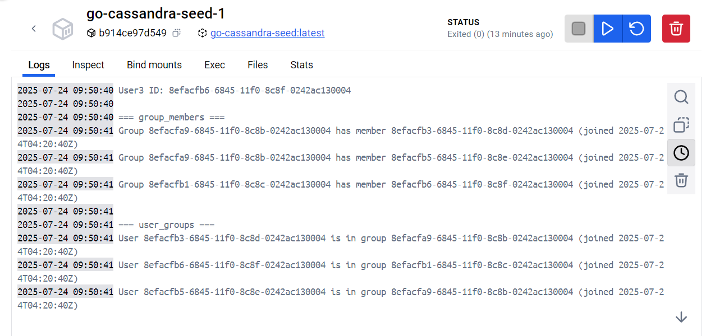
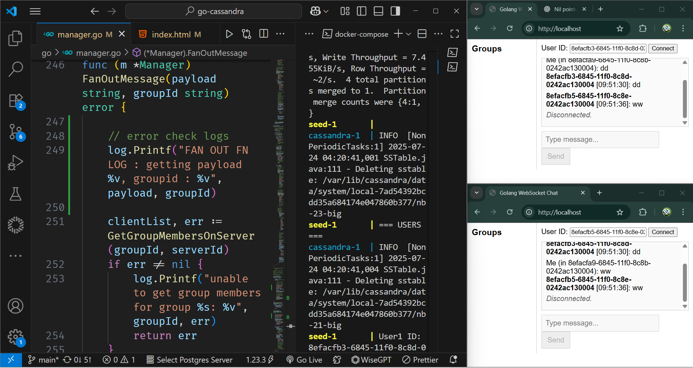

# How To Run The Project

## Run The Container
```bash
docker compose up
```

After running the container you will see logs from the seed-1 container, you can check them in the docker container's logs for seed-1, or simply in your code editor's terminal.



Then simply grab two user-ids from the "user_groups" section logs, who belong to the same group (check the group-ids).

Visit the frontend to http://localhost, on two different browser windows/tabs.
Paste the two user-ids into the id inputs. Start sending out messages. The three users will be spread out across 3 backend servers.



## Making Changes
Currently the seed container initialises the cassandra with two groups and three users. Two users belong to the same group.

Make changes to the seed folder and rebuild the container to see changes.

⚠️ **Note:** Currently the frontend is made only to support the two inbuilt group messages. You can change that to support multiple groups.

Similarily to make changes to project, edit the go folder and rebuild the container.

If you wish to change the DB schema, change it in seed folder and ./go/db.cql file. Also the db.cql file acts as the volume mount for cassandra db so that it shows changes in the real db. So if you change the schemas, delete the current cassandra container and rebuild it.

To rebuild all the containers at once you can also :
```bash
docker compose up --build
```
